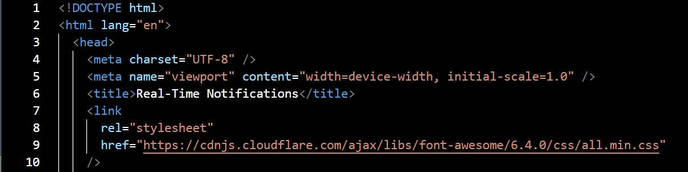

Judul
Membangun Notifikasi Real-Time Menggunakan WebSocket: Solusi Modern untuk Interaksi Web Dinamis

Pendahuluan

Di era digital, kecepatan informasi adalah salah satu kunci kunci saat meningkatkan pengalaman pengguna. Salah satu cara untuk memberikan informasi segera adalah dengan mempresentasikannya dalam pemberitahuan aktual. Teknologi situs web memungkinkan server untuk mengirim data langsung ke klien tanpa permintaan data yang berulang. Dalam artikel ini, kami akan menjelaskan bagaimana sistem pemberitahuan real-time sederhana dibuat, tetapi Webocket diimplementasikan secara efektif dengan contoh implementasi dan penampilan kode.

Pembahasan Utama
Apa itu soket web?
WebSocket adalah protokol komunikasi berbasis TCP yang secara terus-menerus memungkinkan koneksi dua arah antara server dan klien. Berbeda dengan HTTP tradisional, yang merupakan respons permintaan, Weboccket memungkinkan server untuk mengirim data kapan saja selama koneksi terbuka.Keunggulan WebSocket untuk Notifikasi Real-Time

• Tanggung jawab: Jika ada pembaruan tanpa muat ulang, pemberitahuan
akan segera ditampilkan.
• Efisiensi: Tidak ada survei reguler yang penting dari server
• Interaktif: Pengguna dapat berinteraksi secara langsung dengan pemberitahuan.

Struktur pemberitahuan waktu nyata Umumnya, suatu aplikasi dibagi menjadi dua bagian:
 • Server Websocket:
Kirim pemberitahuan secara berkala.
• Klien Web (browser):
menerima dan menunjukkan pemberitahuan.
Implementasi

1. Membuat Server WebSocket (Node.js)

Penjelasan singkat:
•	Server membuat koneksi WebSocket pada port 8080.
•	Setiap 5 detik, server mengirim notifikasi dengan waktu server saat ini.

2. Membuat Klien Web (HTML + JavaScript)

Penjelasan singkat:
•	Klien membuat koneksi WebSocket ke server.
•	Saat menerima pesan, klien membuat elemen notifikasi baru di pojok kanan atas.
•	Notifikasi otomatis hilang setelah 8 detik.

3. Hasil Akhir
Saat program dijalankan:
•	Server akan aktif di ws://localhost:8080.
•	Setiap 5 detik, pengguna akan menerima notifikasi baru yang berisi waktu server saat itu.
•	Notifikasi muncul dengan animasi lembut dan otomatis menghilang setelah beberapa saat.
Contoh hasil tampilannya:

 
[Notifikasi Baru!]
Waktu server: 14:32:10
[Notifikasi Baru!]
Waktu server: 14:32:15
dan seterusnya...

Kesimpulan
Tidak sulit untuk membuat sistem pemberitahuan real-time dengan Wecket. Dengan hanya beberapa baris kode, kita dapat bereaksi lebih hidup, lebih dinamis dan berubah. Websocket sangat cocok untuk berbagai pencarian kebutuhan modern sebagai obrolan, pemantauan dasbor, sistem peringatan, dan banyak lagi.

Referensi
•	MDN Web Docs, "Using WebSockets," https://developer.mozilla.org/en-US/docs/Web/API/WebSockets_API
•	websocket.org, "WebSocket Examples," https://www.websocket.org/echo.html
•	Node.js Documentation, "ws: A WebSocket Library for Node.js," https://github.com/websockets/ws

